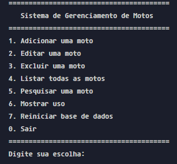

# Projeto de Gerenciamento de Motos



## Descrição do Projeto

Este projeto consiste em um sistema de gerenciamento de motos, desenvolvido em C. O sistema permite realizar operações como cadastro, busca, atualização e remoção de informações sobre motos, além de outras funcionalidades relacionadas ao banco de dados local `database.txt`.

## Funcionalidades Principais

- Cadastro de novas motos
- Busca de motos
- Atualização de informações de motos existentes
- Remoção de motos do sistema
- Interface de linha de comando intuitiva

## Requisitos do Sistema

Para compilar e executar o projeto, é necessário ter o compilador GCC instalado em seu sistema. Siga as instruções abaixo para a instalação, de acordo com seu sistema operacional.

### Instalação do GCC

#### Windows

Execute o PowerShell como administrador e siga os passos:

```powershell
# Instale o Chocolatey (caso não tenha)
Set-ExecutionPolicy Bypass -Scope Process -Force; [System.Net.ServicePointManager]::SecurityProtocol = [System.Net.ServicePointManager]::SecurityProtocol -bor 3072; iex ((New-Object System.Net.WebClient).DownloadString('https://community.chocolatey.org/install.ps1'))

# Instale o MinGW (que inclui o GCC)
choco install mingw
```

#### Linux (Ubuntu/Debian)

Abra o terminal e execute:

```sh
sudo apt update && sudo apt install gcc
```

## Compilação e Execução

Para compilar o projeto:

1. Abra o terminal na pasta raiz do projeto
2. Execute o comando:

```sh
make
```

Para executar o programa após a compilação:

```sh
# Linux
./program

# Windows
program.exe
```

## Estrutura do Projeto

- `Makefile`: Script para automatizar a compilação
- `README.md`: Este arquivo de documentação
- `database.txt`: Arquivo de dados que contém as informações sobre as motos
- `main.c`: Arquivo principal do projeto
